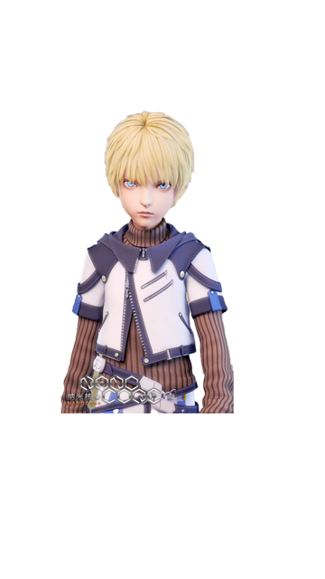
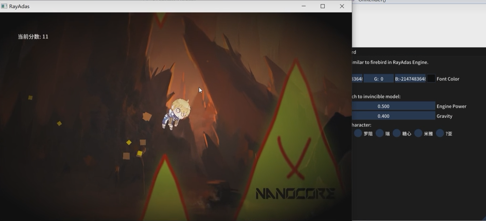

## RayAdas
A simple 2D game engine and games based on it.


### Introduction


### Name

**RayAdas**

One of the main characters in the "NanoCore".



### Usage

```shell
git clone https://github.com/Haruluya/Miya.git
```

### Presentation

###### 

**RayAdas-FireBird**



**RayAdas-Breakout**


### Contact Author 

### License

MIT

